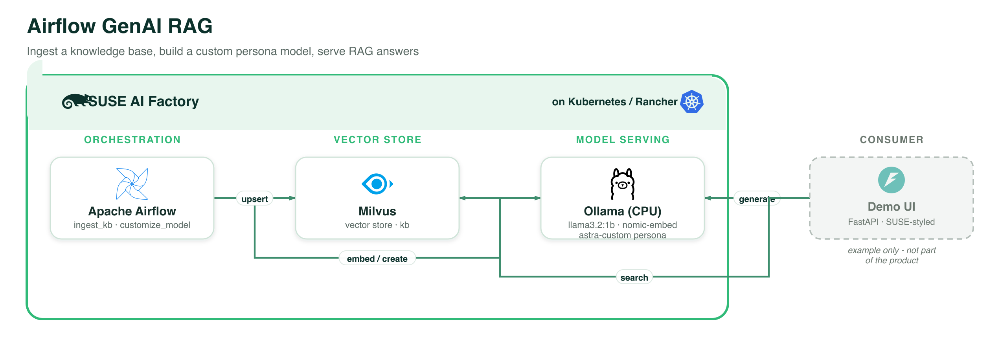

# Airflow GenAI RAG (Ollama) — SUSE AI Factory blueprint

An all-SUSE derivation of Astronomer's
[`gen-ai-fine-tune-rag-use-case`](https://github.com/astronomer/gen-ai-fine-tune-rag-use-case).
It keeps the shape of the original — **Apache Airflow orchestrating a RAG +
model-customization pipeline for an LLM** — but every component comes from the
**SUSE Application Collection** instead of Astro Runtime + OpenAI, and the LLM runs
locally on **Ollama** (CPU, no GPU, no API keys, no data leaving the cluster).

Blueprint CR: [`airflow-genai-rag-1-0-0.yaml`](airflow-genai-rag-1-0-0.yaml)

## Architecture



*Every component runs on **SUSE AI Factory** (Kubernetes / Rancher). The demo UI is shown as an example only and is not part of the product. Vector source: [`../images/airflow-genai-rag.svg`](../images/airflow-genai-rag.svg).*

## Components

| Component | Chart (App Collection) | Role |
|-----------|------------------------|------|
| **Apache Airflow** | `apache-airflow` `1.22.0` (Airflow 3.2.2) | Orchestrates the ingestion + customization DAGs. DAGs delivered via git-sync. |
| **Ollama** | `ollama` `1.55.0` | Serves `llama3.2:1b` (chat) and `nomic-embed-text` (embeddings), CPU-only. |
| **Milvus** | `milvus` `5.0.22` | Vector store for the RAG knowledge base (standalone, kafka disabled). |

## How it works

```
                    ┌──────────────────────── Apache Airflow ────────────────────────┐
 include/knowledge_base/*.md ─▶ ingest_knowledge_base:  chunk ─▶ embed (Ollama) ─▶ Milvus `kb`
 include/examples/*.txt       ─▶ customize_model:       few-shot ─▶ Ollama /api/create ─▶ `astra-custom`
                    └─────────────────────────────────────────────────────────────────┘

 Local demo UI (FastAPI + SUSE style):  topic ─▶ embed ─▶ Milvus search ─▶ generate (astra-custom) ─▶ post
```

- **RAG ingestion** (`dags/ingest_knowledge_base.py`) — reads the markdown knowledge
  base, splits it into overlapping chunks, embeds each chunk with Ollama
  `nomic-embed-text`, and upserts the vectors + metadata into a Milvus collection `kb`.
- **Model customization** (`dags/customize_model.py`) — turns the example posts into
  a system persona + few-shot messages and calls Ollama `/api/create` to build a
  custom model `astra-custom`. This is the CPU-friendly, **no-GPU analogue of the
  original's OpenAI hosted fine-tuning** — it teaches the base model a house *style*
  rather than training weights.
- **Reset** (`dags/clear_milvus.py`) — drops the `kb` collection so you can re-ingest.

The DAGs talk to Ollama and Milvus **over HTTP with `requests` only** (Milvus via its
proxy REST v2 API), so the stock Airflow image needs no extra Python packages.

## Prerequisites (on the target downstream cluster)

1. The **SUSE AI Factory operator** installed (owns the `Blueprint` / `AIWorkload`
   CRDs).
2. The **`application-collection` ClusterRepo** plus an **Opaque** secret carrying the
   raw `user` + `token` for `dp.apps.rancher.io` (no `APP_COLLECTION_TOKEN=` prefix).
3. A **default StorageClass** (Airflow, Ollama, and Milvus all use PVCs).
4. **cert-manager** (for the Airflow UI ingress TLS).

## 1. Publish the DAGs (git-sync)

The blueprint pulls DAGs from a public git repo. Push this folder to a public repo,
then set the `apache-airflow` component's `dags.gitSync` in the Blueprint CR:

```yaml
dags:
  gitSync:
    enabled: true
    repo: https://github.com/<you>/<repo>.git   # <-- your public repo
    branch: main
    ref: main
    subPath: blueprints/airflow-genai-rag/dags  # <-- path to dags/ in that repo
```

> The committed default points at `https://github.com/SUSE/aif-blueprints.git`
> as a placeholder — change it to wherever you pushed this folder.

## 2. Import the blueprint

```bash
kubectl apply -f airflow-genai-rag-1-0-0.yaml     # adds the Blueprint CR
```

Then, in the SUSE AI Factory UI, **create an AIWorkload** from the
*Airflow GenAI RAG (Ollama)* blueprint and pick a target namespace. The operator
deploys all three components (each reachable in-namespace at `http://ollama:11434`,
`http://milvus:19530`, and the Airflow services).

## 3. Run the pipeline

1. Add a DNS record (or `/etc/hosts` entry) for the `airflow-genai` ingress host
   pointing at the cluster's ingress controller, and open the **Airflow UI**.
2. Trigger **`ingest_knowledge_base`** — wait for it to succeed (chunks embedded into
   Milvus).
3. Trigger **`customize_model`** — creates the `astra-custom` model on Ollama.

Verify:

```bash
# custom model exists
kubectl exec -n <ns> deploy/ollama -- ollama list        # or: curl .../api/tags
```

## 4. Run the demo UI (locally)

The demo UI is a FastAPI + SUSE-styled frontend (in [`ui/`](ui/)) that performs RAG
generation against the in-cluster services. Run it locally:

```bash
# 1. Port-forward the two services (separate terminals or with &)
kubectl -n <ns> port-forward svc/ollama 11434:11434
kubectl -n <ns> port-forward svc/milvus 19530:19530

# 2. Start the UI
cd ui
pip install -r requirements.txt
uvicorn app.main:app --host 0.0.0.0 --port 8000
# open http://localhost:8000
```

Enter a topic and hit **Generate**: the UI embeds it, searches Milvus for the closest
knowledge-base chunks, and asks `astra-custom` to write a grounded post — showing the
retrieved sources alongside. The **Search** box does retrieval-only against the KB.

UI configuration (env, with local defaults):

| Env | Default | Purpose |
|-----|---------|---------|
| `OLLAMA_BASE_URL` | `http://localhost:11434` | Ollama API |
| `MILVUS_URI` | `http://localhost:19530` | Milvus proxy REST API |
| `EMBED_MODEL` | `nomic-embed-text` | embedding model |
| `GEN_MODEL` | `astra-custom` | generation model (falls back if not created) |
| `KB_COLLECTION` | `kb` | Milvus collection name |

> Optional: the UI ships a `Dockerfile` so you can publish it and deploy it in-cluster
> (like `suse-vss-ui`) instead of running locally.

## Customize

- **Knowledge base** — add/replace markdown files in `include/knowledge_base/`, then
  re-run `clear_milvus` + `ingest_knowledge_base`.
- **Style** — edit the posts in `include/examples/` (first line = topic, rest = body)
  and the `SYSTEM_PERSONA` in `dags/customize_model.py`, then re-run `customize_model`.
- **Models** — change `BASE_MODEL` / `EMBED_MODEL` in the Blueprint CR's `apache-airflow`
  `env` and the `ollama.models.pull` list. If you change the embedding model, re-ingest.

## Clean up

Delete the AIWorkload from the AI Factory UI, then optionally remove the Blueprint:

```bash
kubectl delete -f airflow-genai-rag-1-0-0.yaml
```

## Layout

```
airflow-genai-rag/
  airflow-genai-rag-1-0-0.yaml   # the Blueprint CR (kubectl apply)
  dags/                          # synced into Airflow via git-sync
    common.py                    # Ollama + Milvus HTTP helpers (requests only)
    ingest_knowledge_base.py     # KB -> chunk -> embed -> Milvus
    customize_model.py           # examples -> Ollama /api/create (astra-custom)
    clear_milvus.py              # drop the kb collection
  include/
    knowledge_base/*.md          # sample knowledge base
    examples/*.txt               # sample "style" posts for customization
  ui/                            # FastAPI + SUSE-styled demo UI (run locally)
    app/main.py  static/  requirements.txt  Dockerfile
```
