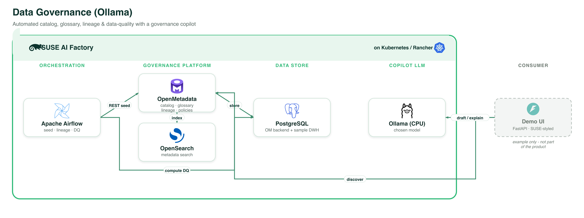

# Data Governance Copilot (Ollama, CPU)

Enterprise **data governance** on [OpenMetadata](https://open-metadata.org) (Apache-2.0)
with a local LLM **copilot**. OpenMetadata is the governance platform; Apache Airflow (the
stock Application Collection image — no custom build) seeds and drives it via REST and
computes data quality over PostgreSQL sample data; a small SUSE-styled FastAPI UI uses a
local Ollama model to help with discovery, glossary drafting, lineage/impact and data
quality.

## What it demonstrates

| Area | How |
|------|-----|
| Catalog + reference/master data | OpenMetadata catalog over an **enterprise DWH** + a **public-administration registry** (external DB) |
| Business glossary | `EnterpriseGlossary` with reference-data terms |
| Data permissions / access matrices | OpenMetadata **teams, roles, policies** |
| Internal & external regulations | **Classifications/tags**: GDPR, DORA, BaFin, PII, Confidential, Internal-Policy |
| Data quality | Profiling + **rule packs** (standard, **financial**, distribution, similarity, cross-checks, a **custom script rule**) + alert |
| Lineage + impact analysis | Lineage graph (architecture-as-lineage) + OpenMetadata Impact Analysis |
| Data risk mapping | `Risk` classification (High/Medium/Low) tagged onto assets |
| Periodic review automation | `periodic_review` DAG scans currency / ownership and files review tasks |
| Data democratization | OpenMetadata search + roles, plus the natural-language copilot |

**Out of scope** (too complex for a demo): importing architecture **diagrams**, designing
"to-be" architecture, deep **unstructured-data** management, and full MDM
**matching/survivorship** (master/reference data is represented as catalog + glossary +
reference tables, not a matching engine).

## Architecture



*Every component runs on **SUSE AI Factory** (Kubernetes / Rancher). The demo UI is shown as an example only and is not part of the product. Vector source: [`../images/data-governance-ollama.svg`](../images/data-governance-ollama.svg).*

- **OpenMetadata** (upstream, Apache-2.0) — catalog/glossary/lineage/DQ/policies/alerts, UI on `:8585`.
- **OpenSearch** (AppCo, Apache-2.0) — OpenMetadata's search engine (single-node, `sysctlInit`
  sets `vm.max_map_count`, so no node-level sysctl prerequisite).
- **PostgreSQL** (upstream Bitnami chart, Apache-2.0) — OpenMetadata's backend **and** the
  sample data sources (`enterprise_dwh`, `gov_registry`). OpenMetadata requires the `pgcrypto`
  extension, which the AppCo Postgres image doesn't ship, so the Bitnami image (which includes
  contrib) is used, pinned to a PG16 tag.
- **Apache Airflow** (AppCo, stock image) — the governance DAGs (`requests` + `psycopg2` only).
- **Ollama** (AppCo) — the copilot LLM (model chosen at import).

OpenMetadata runs with `pipelineServiceClientConfig.enabled=false`, so it does **not** deploy
its own ingestion Airflow — the AppCo Airflow drives it via REST. No custom OpenMetadata image.

## Prerequisites (target cluster)

- SUSE AI Factory operator; the `application-collection` ClusterRepo (+ credentials secret);
  a default StorageClass; cert-manager.
- One **upstream ClusterRepo** — OpenMetadata isn't in the Application Collection. bpm
  applies it automatically at import (`clusterResources`), or apply it manually:
  ```bash
  kubectl apply -f clusterrepos/openmetadata-clusterrepo.yaml
  kubectl apply -f clusterrepos/bitnami-clusterrepo.yaml
  ```
- This is a **large** workload (OpenSearch + OpenMetadata are JVM services) — use a
  well-resourced node.

## Run

1. Create the ClusterRepos (above), import the blueprint, then create an **AIWorkload** in the
   SUSE AI Factory UI. Wait for PostgreSQL, OpenSearch, OpenMetadata (migration job → server),
   Airflow and Ollama to be Ready.
2. From the marketplace guide, click **Run pipeline (Airflow)** to run
   `seed_governance → build_lineage → data_quality → periodic_review` (or run them manually in
   the Airflow UI, login `admin`/`admin`).
3. Open the **OpenMetadata UI** (`admin@open-metadata.org` / `admin`) to explore the catalog,
   glossary, lineage/impact, data-quality suites and roles/policies.
4. Launch the **copilot** UI and try discovery, glossary drafting, lineage/impact and DQ
   summaries.

> Demo only, unsupported. Passwords/keys in the CR are placeholders.
