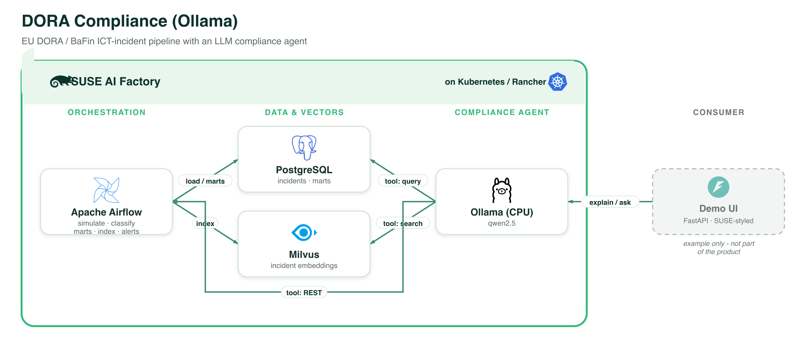

# DORA Compliance Analysis (Ollama, CPU)

An EU **DORA (Digital Operational Resilience Act)** ICT-incident compliance blueprint.
**Apache Airflow** simulates synthetic ICT operational incidents, classifies each one against
the **BaFin Article 18** thresholds (CRITICAL / MAJOR / MINOR + reporting deadline), builds
compliance **marts** in **PostgreSQL**, and indexes the incidents in **Milvus** for semantic
search. A local SUSE-styled UI shows the severity split, the BaFin reporting queue and SLA
breaches; a local **LLM (Ollama, `qwen2.5`)** **explains** individual incidents and acts as a
compliance **agent** that searches the data and drives the pipeline.

> **Faithful to the classifier rules of [Chirag-Kathuria-009/DORA-Pipeline](https://github.com/Chirag-Kathuria-009/DORA-Pipeline)**
> (MIT). The reference's Kafka + PySpark + Iceberg + dbt + Great Expectations + Superset stack
> is replaced by Airflow Python tasks + PostgreSQL + Milvus + this local UI — the all-SUSE
> Application Collection pattern. See [`ATTRIBUTION.md`](ATTRIBUTION.md).
>
> The reference pipeline has **no LLM** — the *explain* + *agent* layer is this blueprint's
> addition.

This is the **CPU / Ollama** variant. For the **GPU / vLLM** variant (same pipeline, LLM
served by vLLM), see [`../dora-compliance-vllm`](../dora-compliance-vllm).

Blueprint CR: [`dora-compliance-ollama-1-0-0.yaml`](dora-compliance-ollama-1-0-0.yaml)

## Architecture

*Every component runs on **SUSE AI Factory** (Kubernetes / Rancher). The demo UI is shown as an example only and is not part of the product. Vector source: [`../images/dora-compliance-ollama.svg`](../images/dora-compliance-ollama.svg).*

## Components (all from the SUSE Application Collection)

| Component | Chart | Role |
|-----------|-------|------|
| **Apache Airflow** | `apache-airflow` `1.22.0` | orchestrates simulate → classify → marts → index → alerts (DAGs via git-sync) |
| **PostgreSQL** | `postgresql` `0.6.0` (`dora-db`) | raw incidents, classifications, and the compliance marts |
| **Milvus** | `milvus` `5.0.22` | incident embeddings for the agent's semantic search |
| **Ollama** | `ollama` `1.55.0` | `qwen2.5` — the compliance analyst + agent LLM, CPU |
| **Compliance UI** | — (local) | FastAPI + SUSE dashboard in [`ui/`](ui/), runs locally |

## Pipeline (Airflow DAGs, in [`dags/`](dags/))

1. **`simulate_incidents`** — generate `N_INCIDENTS` (default 600) synthetic ICT incidents with
   the impact metrics BaFin classification needs, into PostgreSQL.
2. **`classify_and_load`** — apply the DORA / BaFin Article 18 rules engine
   ([`common.classify_incident`](dags/common.py)): CRITICAL (≥25% clients / ≥€1M / cyber ≥10% /
   cross-border ≥10%), MAJOR (≥10% clients / ≥€100K / third-party outage), else MINOR — plus
   notification deadline (4h / 72h) and ICT-provider concentration tier.
3. **`build_marts`** — `mart_bafin_report` + `mart_vendor_risk` (+ data-quality checks that
   fail loudly, replacing Great Expectations).
4. **`index_incidents`** — embed incidents and load them into Milvus (a lightweight
   deterministic hashing embedding — no extra model, identical on CPU and GPU).
5. **`check_compliance_alerts`** — `mart_sla_breach`: reporting deadlines breached / imminent.
6. **`clear_data`** — reset everything.

## The LLM layer

- **Explain** — click **Explain** on any incident: the LLM returns a compliance verdict
  (severity justification, authority + deadline, recommended reporting action).
- **Compliance agent** — an OpenAI **function-calling** loop. Its tools search classified
  incidents (through Airflow's Postgres connection), run Milvus semantic search, read the BaFin
  / vendor-risk / SLA-breach marts, and **trigger / monitor the pipeline via the Airflow REST
  API** (Airflow 3: `POST /auth/token` → `/api/v2`). The UI shows the agent's tool-call trace,
  so you can watch it "act like an agent". Try *"which ICT providers caused critical
  incidents?"*, *"show breached reporting deadlines"*, or *"run the whole pipeline"*.

## Use it via the Blueprint Marketplace (recommended)

Pick **DORA Compliance Analysis (Ollama, CPU)** and follow the guide: import → create the
AIWorkload in AI Factory → run the DAGs in Airflow (or ask the agent to) → it starts the local
UI + port-forwards for you → explore incidents and ask the compliance agent.

## Notes

- **Batch size**: `N_INCIDENTS` (Airflow `env` on the blueprint) controls how many incidents
  are simulated. Raise it for a bigger demo.
- **Airflow image (stock, no bake)**: the DAGs import only `psycopg2` + `requests`, and both
  are already in the stock SUSE App Collection image
  (`dp.apps.rancher.io/containers/apache-airflow:3.2.2-8.14` — `psycopg2` ships with Airflow's
  Postgres provider, `requests` is an Airflow core dep). So this blueprint uses that image
  directly — no custom build or private registry needed (unlike the fraud blueprint, which
  needed heavy ML libraries).
- **Semantic search** uses a deterministic hashing embedding (`common.hash_embed`, mirrored in
  the UI) so it needs no embedding model and behaves identically on the CPU and GPU variants.
- **Agent + Airflow REST**: the local UI port-forwards the Airflow API server on `:8080` and
  authenticates with `admin/admin` (demo defaults) to trigger DAGs.
- **Demo only** — the data is synthetic and the thresholds are a simplified reading of BaFin
  Article 18; this is not compliance advice.
