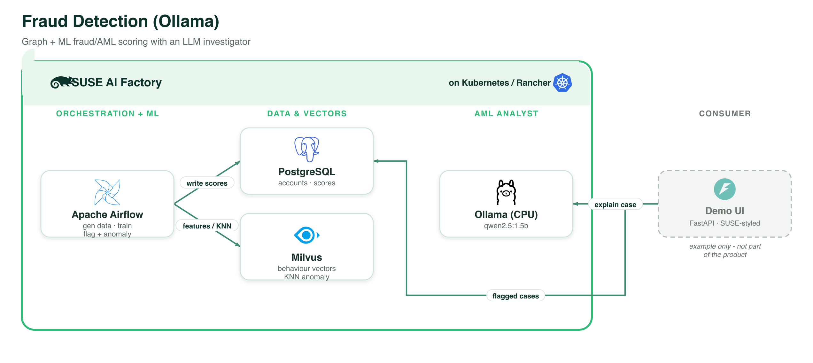

# Fraud / AML Detection (Ollama, CPU)

A financial-crime / money-laundering / anomaly-detection blueprint. **Apache Airflow**
generates and manipulates a synthetic fraud graph, **trains an XGBoost classifier** on the
labelled data, and indexes behavioural feature vectors in **Milvus** for anomaly detection; a
local SUSE-styled investigator UI uses a local **LLM (Ollama, `qwen2.5:1.5b`)** as an **AML
analyst** to classify and explain flagged accounts.

> **Inspired by and with thanks to [SantanderAI/gen-fraud-graph](https://github.com/SantanderAI/gen-fraud-graph)**
> (Apache-2.0) — the synthetic fraud-graph generator this blueprint builds on — and
> [srinivas-gajulaa/genai-fraud-detection](https://github.com/srinivas-gajulaa/genai-fraud-detection)
> for the analyst-explanation pattern. See [`ATTRIBUTION.md`](ATTRIBUTION.md).

This is the **CPU / Ollama** variant. For the **GPU / vLLM** variant (same pipeline, LLM
served by vLLM), see [`../fraud-detection-vllm`](../fraud-detection-vllm).

Blueprint CR: [`fraud-detection-ollama-1-0-0.yaml`](fraud-detection-ollama-1-0-0.yaml)

## Architecture

*Every component runs on **SUSE AI Factory** (Kubernetes / Rancher). The demo UI is shown as an example only and is not part of the product. Vector source: [`../images/fraud-detection-ollama.svg`](../images/fraud-detection-ollama.svg).*

## Components (all from the SUSE Application Collection)

| Component | Chart | Role |
|-----------|-------|------|
| **Apache Airflow** | `apache-airflow` `1.22.0` | orchestrates generate → train → anomaly (DAGs via git-sync) |
| **PostgreSQL** | `postgresql` `0.6.0` (`fraud-db`) | accounts, transactions, labels, scores, flagged accounts |
| **Milvus** | `milvus` `5.0.22` | per-account behavioural feature vectors for anomaly detection |
| **Ollama** | `ollama` `1.55.0` | `qwen2.5:1.5b` — the AML analyst LLM, CPU |
| **Investigator UI** | — (local) | FastAPI + SUSE dashboard in [`ui/`](ui/), runs locally |

## Pipeline (Airflow DAGs, in [`dags/`](dags/))

1. **`generate_fraud_dataset`** — generate a synthetic fraud graph with
   `gen-fraud-graph` (accounts + transactions with injected **laundering rings**), size set by
   `SCALE_FACTOR` (default `0.001` ≈ 10k accounts / 90k tx), and load it into PostgreSQL.
2. **`engineer_and_train`** — build per-account graph/behavioural features (degrees, amount
   stats, high-value-edge counts, **high-value-cycle membership** via networkx), label from the
   ground-truth rings, **train XGBoost** (SMOTE for imbalance), batch-score all accounts, and
   record precision/recall/F1/AUC.
3. **`flag_and_anomaly`** — index normalised feature vectors in Milvus, compute an anomaly
   score (distance to nearest neighbours), and write the top **flagged accounts** (combining
   model score + anomaly + ring membership).
4. **`clear_data`** — reset everything.

The LLM then explains flagged cases on demand in the UI (typology, risk rationale, recommended
action) — the "ML score → LLM analyst" pattern.

## Use it via the Blueprint Marketplace (recommended)

Pick **Fraud / AML Detection (Ollama, CPU)** and follow the guide: import → create the
AIWorkload in AI Factory → run the three DAGs in Airflow → it starts the local UI +
port-forwards for you → investigate flagged accounts.

## Notes

- **Scale**: `SCALE_FACTOR` (Airflow `env` on the blueprint) controls dataset size. The demo
  default is tiny; raising it (and Airflow resources) is exactly why the pipeline is on Airflow.
- **Airflow image (baked)**: the DAGs need real Python libraries (pandas, networkx,
  scikit-learn, xgboost, imbalanced-learn, psycopg2, gen-fraud-graph). Installing them at pod
  start via `_PIP_ADDITIONAL_REQUIREMENTS` did **not** work here: the hardened SUSE App
  Collection Airflow image ships without `pip`, and even on a pip-capable image the install
  (xgboost is ~98 MB) was **slower than Fleet's reconcile interval**, so the migration pod was
  recreated mid-download and never finished → Airflow never became Ready. So this blueprint
  uses a **baked custom image**: `ghcr.io/alessandro-festa/fraud-airflow:1.0.0`, built **FROM
  the SUSE App Collection base** (`dp.apps.rancher.io/containers/apache-airflow:3.2.2-8.14`,
  bootstrapped with `ensurepip`) with all deps pre-installed. Build recipe:
  [`airflow-image/Dockerfile`](airflow-image/Dockerfile). To rebuild:
  `cd airflow-image && docker build -t ghcr.io/<you>/fraud-airflow:1.0.0 .` (requires
  `docker login dp.apps.rancher.io` with your App Collection credentials), then point
  `images.airflow` at your image. Note: the published image is **arm64** (matching the sims
  cluster); rebuild for amd64 if needed.
- **Data stores**: transactions/labels/scores in PostgreSQL (`fraud-db`), anomaly vectors in
  Milvus. No graph database is required (ring detection runs in-DAG with networkx).
- The XGBoost model is trained + used for batch scoring inside Airflow (results in Postgres);
  interactive scoring of new transactions is a possible future addition.
