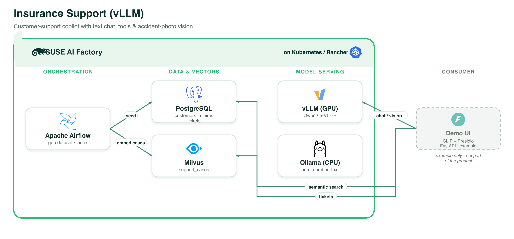

# Insurance Support Copilot (vLLM, GPU)

The GPU variant of the Insurance Support Copilot. A local chat UI lets a customer
upload an accident photo, describe their issue, **open/close support tickets**, and
get **similar past cases suggested — redacted** (PII removed) with Presidio. Chat +
accident-photo vision is served by **Qwen2.5-VL-7B on vLLM**.

> ⚠️ **Demo only.** All data is **synthetic**. Presidio redaction is best-effort —
> pair with access control + encryption for real use.

## Architecture



*Every component runs on **SUSE AI Factory** (Kubernetes / Rancher). The demo UI is shown as an example only and is not part of the product. Vector source: [`../images/insurance-support-vllm.svg`](../images/insurance-support-vllm.svg).*

## Flow

```
Airflow ─ generate_dataset → Postgres (customers/families/policies/claims/tickets)
        └ index_cases      → embed tickets (Ollama nomic-embed) → Milvus support_cases

Local chat UI ─ chat + accident photo → vLLM Qwen2.5-VL-7B (chat + vision)
   ├ semantic search : text  → nomic-embed → Milvus → redact (Presidio) → show
   ├ similarity      : photo → CLIP        → Milvus → redact → show
   ├ open/close ticket: model proposes → you confirm → Postgres write
   └ browse recent tickets
```

## Components

| Component | Chart (repo) | Notes |
|---|---|---|
| PostgreSQL | `postgresql` (application-collection) | `support-db:5432`. |
| Milvus | `milvus` (application-collection) | Standalone + REST v2 at `milvus:19530`. |
| vLLM | `vllm` (application-collection) | **GPU**; `Qwen/Qwen2.5-VL-7B-Instruct` behind `vllm-router-service:80`. |
| Ollama | `ollama` (application-collection) | CPU; `nomic-embed-text` for embeddings only. |
| Apache Airflow | `apache-airflow` (application-collection) | Custom image (Faker + psycopg2); DAGs via git-sync. |

CLIP (`clip-ViT-B-32`) and Presidio run in the local UI on CPU. The support-agent
persona is applied as a system prompt (no `customize_model` DAG in this variant).

## Why a small Ollama alongside vLLM?

vLLM serves the chat/vision model; embeddings use the OpenAI-compatible `/v1/embeddings`
endpoint. To keep the embedding path identical to the Ollama variant (and avoid relying
on the vLLM chart serving an embedding model), a small **CPU** Ollama serves
`nomic-embed-text`. Swap it for a vLLM embedding modelSpec if you prefer everything on GPU.

## Airflow DAGs

1. **generate_dataset** — Faker synthetic insurance data → Postgres (size via `N_TICKETS`).
2. **index_cases** — embeds resolved/closed tickets → Milvus `support_cases`.

## Airflow image

Uses the **stock** SUSE Application Collection `apache-airflow` image — no custom image
to build. The DAGs use only Python stdlib + `psycopg2` (already present for Airflow's
Postgres metadata backend).

## Requirements

- SUSE AI Factory operator; `application-collection` ClusterRepo (+ credentials);
  a default StorageClass; cert-manager; a node with a **real NVIDIA GPU** + the GPU Operator.
- Host tools for the local UI: `python3` (venv with CPU torch + sentence-transformers +
  Presidio + a small spaCy model).

For a CPU version (Qwen2.5-VL on Ollama) use **Insurance Support Copilot (Ollama, CPU)**.

## Redaction

Retrieved similar cases pass through Presidio (analyzer → anonymizer) in the UI before
display, with custom `POLICY_NUMBER`/`CLAIM_ID` recognizers plus built-ins; a regex
fallback applies if Presidio can't initialise.
