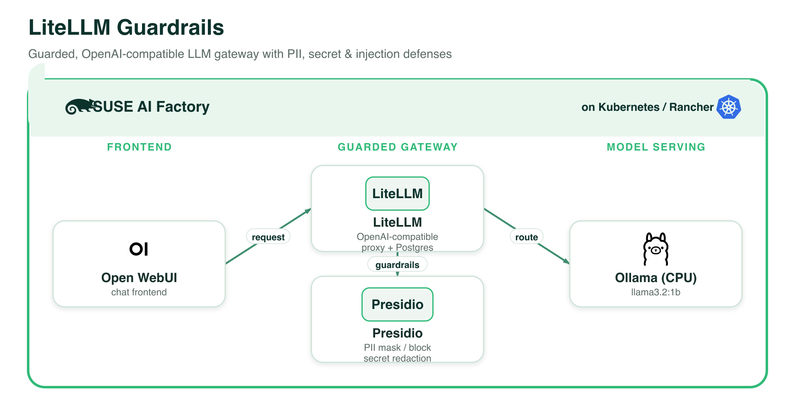

# LiteLLM Guardrails (Ollama + Open WebUI)

A guarded LLM gateway demo for SUSE AI Factory. Every chat message flows through a
**LiteLLM** proxy that enforces **guardrails** before the prompt reaches the model:

```
Open WebUI  ──►  LiteLLM proxy (guardrails)  ──►  Ollama (llama3.2:1b, CPU)
                     │
                     ├─ Presidio PII masking / blocking  (presidio-analyzer + presidio-anonymizer)
                     ├─ Secret / API-key redaction       (hide-secrets)
                     └─ Prompt-injection detection        (detect_prompt_injection)
```

Because Open WebUI is pointed **only** at LiteLLM's OpenAI-compatible endpoint (not at
Ollama directly), the guardrails you select are always applied.

> **⚠️ Container image / architecture.** This blueprint ships the LiteLLM component
> with the **multi-arch upstream image** `ghcr.io/berriai/litellm-database:main-stable`
> so it also runs on **arm64** clusters (e.g. Apple-silicon dev VMs). The SUSE AI
> registry image `registry.suse.com/ai/containers/litellm-database:v1.81.13` is
> **amd64-only** and fails on arm64 with *"no match for platform in manifest"*. On an
> amd64 cluster, prefer the SUSE-supported image — swap the `image:` block of the
> `litellm` component in `litellm-guardrails-1-0-0.yaml` back to it.

## Architecture



*Every component runs on **SUSE AI Factory** (Kubernetes / Rancher). The demo UI is shown as an example only and is not part of the product. Vector source: [`../images/litellm-guardrails.svg`](../images/litellm-guardrails.svg).*

## Components

| Component | Chart (repo) | Image | Notes |
|-----------|--------------|-------|-------|
| Ollama | `ollama` (`application-collection`) | `dp.apps.rancher.io/containers/ollama` | CPU, pulls `llama3.2:1b` |
| LiteLLM | `litellm` (`suse-ai-registry`) | `registry.suse.com/ai/containers/litellm-database:v1.81.13` | OpenAI-compatible proxy + bundled Postgres; image pulled with the `application-collection` secret |
| Presidio | (LiteLLM `extraResources`) | `mcr.microsoft.com/presidio-analyzer` + `presidio-anonymizer` | **Only non-SUSE images** (no SUSE equivalent). Always deployed |
| Open WebUI | `open-webui` (`application-collection`) | `dp.apps.rancher.io/containers/open-webui` | Chat frontend, talks to LiteLLM `/v1` |

## The guardrail wizard

This blueprint declares an `importWizard` in `marketplace.yaml`. In the Blueprint
Marketplace, the **import** step shows a checklist of guardrails; your selection is
deep-merged into the `litellm` component's `proxy_config` **before** `kubectl apply`
(guardrail entries are appended, so options compose). Available options:

- **PII masking (Presidio)** — *default on*. Masks emails, credit cards, phone
  numbers, SSNs, names, etc.; the model receives placeholders.
- **PII blocking (Presidio)** — rejects requests containing high-risk PII instead of
  masking (`pii_entities_config: BLOCK`). Selecting mask **and** block together is
  contradictory — **block wins** for the configured entities.
- **Secret / API-key redaction** — LiteLLM `hide-secrets` guardrail.
- **Prompt-injection detection** — LiteLLM `detect_prompt_injection` callback.

If you import with no options checked, LiteLLM runs with no guardrails.

## Prerequisites (target cluster)

- SUSE AI Factory operator;
- the `application-collection` ClusterRepo + credentials secret (also the pull secret
  for the LiteLLM image) and the `suse-ai-registry` ClusterRepo;
- a default StorageClass (Ollama, LiteLLM's Postgres, and Open WebUI use PVCs);
- cert-manager.

## Run the demo

1. In the marketplace, open **LiteLLM Guardrails**, choose your guardrails, and
   **Import**.
2. In the SUSE AI Factory UI: **Blueprints → LiteLLM Guardrails → Create AIWorkload**,
   pick a namespace, deploy. Wait for Ollama (pulls `llama3.2:1b`), LiteLLM + Postgres,
   both Presidio pods, and Open WebUI to be Ready. Enter the namespace in the guide.
3. Open **Open WebUI** from the guide, select `llama-3.2-1b`, and send a message with
   an email or credit-card number. Watch the guardrail mask/block it.

### Test the proxy directly

```bash
kubectl -n <namespace> port-forward svc/litellm 4000:4000
curl http://127.0.0.1:4000/v1/chat/completions \
  -H "Authorization: Bearer sk-guardrails-demo" \
  -H "Content-Type: application/json" \
  -d '{"model":"llama-3.2-1b","messages":[{"role":"user","content":"My email is jane.doe@example.com and my card is 4111 1111 1111 1111"}]}'
```

With PII masking on, the request LiteLLM forwards to Ollama has the email/card
replaced by `<EMAIL_ADDRESS>` / `<CREDIT_CARD>`.

## Notes

- **Demo only, unsupported.** The master key (`sk-guardrails-demo`) and Postgres
  password are demo placeholders — change them for anything real.
- Presidio pods are always deployed (both PII options need them). They are small.
- `hide-secrets` uses the open-source detect-secrets integration; some other LiteLLM
  guardrail providers require a LiteLLM enterprise license and are intentionally not
  offered here.
