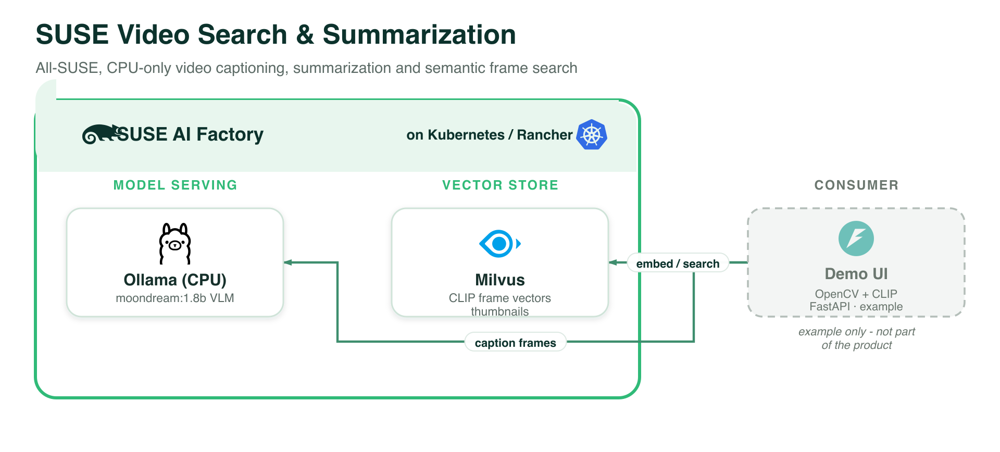

# SUSE VSC — Video Search and Summarization (all-SUSE, CPU, local UI)

An all-SUSE / **non-NVIDIA** Video Search & Summarization stack that runs purely on
**CPU**. Ported from the sims example blueprint, with one change: the **UI is no longer
an in-cluster container** — it runs **locally** (started by the Blueprint Marketplace) and
connects to the in-cluster services over `kubectl port-forward`.

Blueprint CR: [`suse-vss-minimal-1-0-0.yaml`](suse-vss-minimal-1-0-0.yaml)

## Architecture



*Every component runs on **SUSE AI Factory** (Kubernetes / Rancher). The demo UI is shown as an example only and is not part of the product. Vector source: [`../images/suse-vss.svg`](../images/suse-vss.svg).*

## Components

| Component | Chart (App Collection) | Role |
|-----------|------------------------|------|
| **Ollama** | `ollama` `1.55.0` | `moondream:1.8b` multimodal VLM/LLM, CPU-only |
| **Milvus** | `milvus` `5.0.22` | stores each frame's CLIP embedding, thumbnail + metadata (standalone, kafka off) |
| **SUSE VSC UI** | — (local) | FastAPI + SUSE-styled frontend in [`ui/`](ui/); also runs a CPU **CLIP** model for frame search. **Runs locally**, not in-cluster. |

Compared to the sims version, the `suse-vss-ui` Helm component (and its `sims-charts`
ClusterRepo dependency) is **removed** from the Blueprint CR — so importing this blueprint
deploys only Ollama + Milvus.

## How it works

1. In the UI you pick a video source (URL / upload / webcam / YouTube / RTSP), choose a
   pre-baked or custom prompt, and hit **Analyse**. Frames are sampled (OpenCV, count +
   resolution adapt to the CPU) and each frame + the prompt go to Ollama's
   OpenAI-compatible `/v1/chat/completions` (`moondream:1.8b`); captions stream in and a
   summary is produced.
2. Each frame's **CLIP image embedding**, a thumbnail and metadata are stored in **Milvus**.
3. **Search** does text→image semantic search over stored frames via CLIP.

## Prerequisites (on the target cluster)

1. The **SUSE AI Factory operator** (owns the Blueprint / AIWorkload CRDs).
2. The **`application-collection` ClusterRepo** + an Opaque secret with raw `user` + `token`.
3. A **default StorageClass** (Ollama + Milvus use PVCs).
4. **cert-manager**.

## Use it via the Blueprint Marketplace (recommended)

Run the marketplace, select this blueprint, and follow the guided demo — it imports the CR,
points you to create the AIWorkload in AI Factory, then **starts the local UI + port-forwards
for you**.

## Or run it manually

```bash
# 1. Import the Blueprint CR
kubectl apply -f suse-vss-minimal-1-0-0.yaml

# 2. Create an AIWorkload from it in the SUSE AI Factory UI (pick a namespace <ns>)

# 3. Port-forward the services
kubectl -n <ns> port-forward svc/ollama 11434:11434
kubectl -n <ns> port-forward svc/milvus 19530:19530

# 4. Run the UI locally (first run installs CPU torch + CLIP; takes a few minutes)
cd ui
python3 -m venv .venv && . .venv/bin/activate
pip install torch==2.5.1 --index-url https://download.pytorch.org/whl/cpu
pip install -r requirements.txt
OLLAMA_BASE_URL=http://localhost:11434/v1 MILVUS_URI=http://localhost:19530 \
  uvicorn app.main:app --host 0.0.0.0 --port 8000
# open http://localhost:8000
```

## UI configuration (env)

| Env | Default (local) | Purpose |
|-----|-----------------|---------|
| `OLLAMA_BASE_URL` | `http://localhost:11434/v1` | Ollama OpenAI-compatible API |
| `VLM_MODEL` | `moondream:1.8b` | multimodal model |
| `CLIP_MODEL` | `clip-ViT-B-32` | CLIP model for frame search |
| `MILVUS_URI` | `http://localhost:19530` | Milvus |
| `FRAME_COUNT` | `0` | 0 = auto (adapt to CPU); >0 forces a fixed count |

> The `ui/Dockerfile` is kept for reference / optional in-cluster use, but the marketplace
> runs this UI locally by default.
