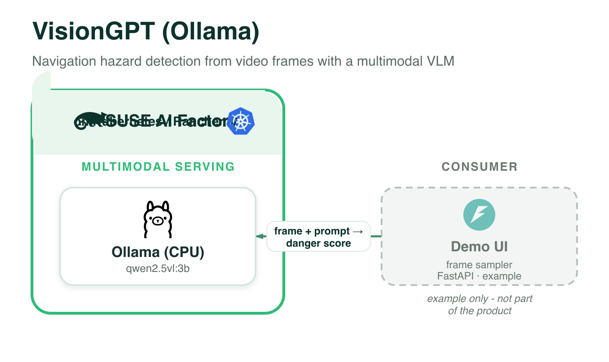

# VisionGPT (Ollama, CPU) — navigation hazard detection

A SUSE / vision-language derivation of
[AIS-Clemson/VisionGPT](https://github.com/AIS-Clemson/VisionGPT) ("LLM-Assisted
Real-Time Anomaly Detection for Safe Visual Navigation"). It analyses a walking video
and, per sampled frame, returns a **danger score (0/1)** and a **short reason**, at a
selectable **sensitivity** (low / normal / high) — a navigation assistant for blind or
low-vision users.

The original used YOLO-World + a text-only LLM over detection metadata. This version is
**VLM-native**: frames are sent directly to a vision-language model. Here that model is
**Qwen2.5-VL 3B on Ollama (CPU)**. For the GPU-served vLLM version of the same model, see
[`../visiongpt-vllm`](../visiongpt-vllm).

Blueprint CR: [`visiongpt-ollama-1-0-0.yaml`](visiongpt-ollama-1-0-0.yaml)

## Architecture



*Every component runs on **SUSE AI Factory** (Kubernetes / Rancher). The demo UI is shown as an example only and is not part of the product. Vector source: [`../images/visiongpt-ollama.svg`](../images/visiongpt-ollama.svg).*

## Components

| Component | Chart (App Collection) | Role |
|-----------|------------------------|------|
| **Ollama** | `ollama` `1.55.0` | serves `qwen2.5vl:3b` (Qwen2.5-VL, multimodal), CPU-only |
| **VisionGPT UI** | — (local) | FastAPI + SUSE UI in [`ui/`](ui/); samples frames + calls the VLM. Runs locally. |

## How it works

1. The UI samples frames from the video (OpenCV) every ~1.5s.
2. Each frame is sent (base64) to Ollama's OpenAI-compatible `/v1/chat/completions`
   with a VisionGPT-style prompt (navigation-assistant persona + spatial guidance +
   sensitivity tier) asking for `{"danger_score": 0|1, "reason": "<=10 words"}`.
3. Results stream into a timeline (green = clear, red = hazard) with thumbnails.

## Use it via the Blueprint Marketplace (recommended)

Run the marketplace, pick **VisionGPT (Ollama, CPU)**, and follow the guide: import →
create the AIWorkload in AI Factory → it starts the local UI + port-forward for you →
analyse the bundled `walk.mp4`.

## Or run it manually

```bash
kubectl apply -f visiongpt-ollama-1-0-0.yaml            # import the Blueprint CR
# create an AIWorkload from it in the AI Factory UI (namespace <ns>); wait for Ollama Ready
kubectl -n <ns> port-forward svc/ollama 11434:11434
cd ui
python3 -m venv .venv && . .venv/bin/activate
pip install -r requirements.txt
OPENAI_BASE_URL=http://localhost:11434/v1 VLM_MODEL=qwen2.5vl:3b \
  uvicorn app.main:app --host 0.0.0.0 --port 8000
# open http://localhost:8000
```

## Sample video

`ui/samples/walk.mp4` is a tiny synthetic clip so the pipeline works out of the box. For
a realistic demo, drop a real first-person walking clip into `ui/samples/` (or use the
**upload** button in the UI).

## Configuration (UI env)

| Env | Default | Purpose |
|-----|---------|---------|
| `OPENAI_BASE_URL` | `http://localhost:11434/v1` | OpenAI-compatible endpoint (Ollama) |
| `VLM_MODEL` | `qwen2.5vl:3b` | vision-language model id |
| `SENSITIVITY` | `normal` | default sensitivity (low/normal/high) |
| `FRAME_INTERVAL` | `0` (auto ≈1.5s) | seconds between sampled frames |
| `MAX_FRAMES` | `40` | cap on frames analysed per run |

> CPU inference is slow (seconds per frame). For low latency, use the vLLM/GPU variant.
