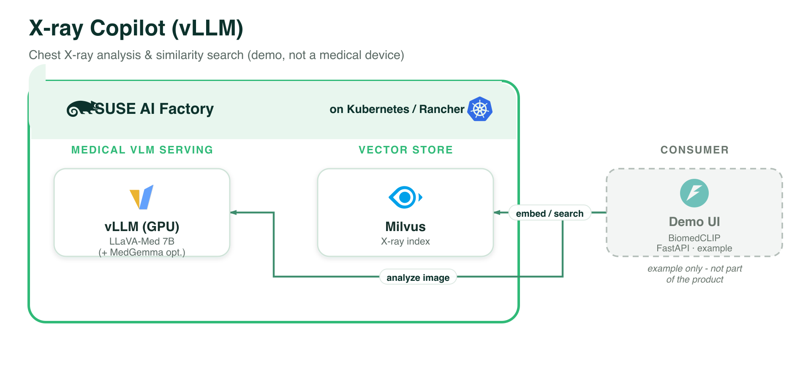

# Chest X-ray Copilot (vLLM, GPU)

A medical-imaging demo blueprint. Upload a chest X-ray, get an analysis from a
medical vision-language model, and search a Milvus index of X-rays by **image**
(similarity) or **text** (semantic) using **BiomedCLIP** embeddings.

> ⚠️ **Demo only — not a medical device and not for clinical decision-making.**
> Outputs are illustrative and may be wrong.

## Architecture



*Every component runs on **SUSE AI Factory** (Kubernetes / Rancher). The demo UI is shown as an example only and is not part of the product. Vector source: [`../images/xray-copilot-vllm.svg`](../images/xray-copilot-vllm.svg).*

## Flow

```
Local UI (upload/pick X-ray)
   ├── analysis:  image → vLLM (MedGemma / LLaVA-Med) over OpenAI /v1/chat/completions
   └── search:    image → BiomedCLIP embedding (CPU, in UI) → Milvus
                  text  → BiomedCLIP text embedding        → Milvus  (shared space)
```

## Components

| Component | Chart (repo) | Notes |
|---|---|---|
| vLLM | `vllm` (application-collection) | Serves the model(s) behind `vllm-router-service:80`. |
| Milvus | `milvus` (application-collection) | Standalone + REST v2 proxy; vector DB at `milvus:19530`. |

BiomedCLIP (`microsoft/BiomedCLIP-PubMedBERT_256-vit_base_patch16_224`, MIT, 512-dim)
runs **in the local UI on CPU** — there is no embedding component in the cluster.

## Models

- **LLaVA-Med 7B** (`chaoyinshe/llava-med-v1.5-mistral-7b-hf`) — **baseline / default**.
  ⚠️ **CC BY-NC 4.0, RESEARCH ONLY** — Microsoft explicitly prohibits deployed/
  commercial use and any clinical decision-making. The `-hf` fork is used so vLLM can
  load it and is **ungated** (no HF token needed); it may need a LLaVA `--chat-template`
  on some vLLM versions.
- **MedGemma 1.5 4B** (`google/medgemma-1.5-4b-it`) — **optional**, enabled in the
  wizard, chest-X-ray tuned. **Gated** on HuggingFace: accept the terms at
  <https://huggingface.co/google/medgemma-1.5-4b-it>, create a read token, and paste
  it into the wizard. Licensed under Google **HAI-DEF** terms (commercial use
  permitted, *not* clinical-grade). Enabling it adds a **second GPU** request.

## HuggingFace token (import wizard)

The wizard's **HuggingFace token** field is **optional** — needed only if you enable
MedGemma (LLaVA-Med is ungated). When provided, the token replaces the `{{HF_TOKEN}}`
placeholder in the MedGemma `hf_token` in the Blueprint CR so vLLM can pull the gated
model. It is stored in the Blueprint CR values (visible via `kubectl get blueprint
-o yaml`) — acceptable for a demo cluster; prefer a scoped read token.

## Requirements

- SUSE AI Factory operator; `application-collection` ClusterRepo (+ credentials);
  a default StorageClass; cert-manager.
- A node with a **real NVIDIA GPU** and the GPU Operator (one GPU for MedGemma, a
  second if LLaVA-Med is enabled).
- Host tools for the local UI: `python3` (the marketplace builds a venv and installs
  a CPU-only torch + open_clip + pymilvus).

For a CPU version (MedGemma via Ollama, no LLaVA-Med) use **Chest X-ray Copilot
(Ollama, CPU)**.

## Sample X-rays

Bundled under `ui/static/samples/` (from Wikimedia Commons, for demonstration):

- `normal-chest.jpg` — normal PA chest radiograph.
- `lobar-pneumonia.jpg` — right lobar pneumonia (CC0, Mikael Häggström, M.D.).
- `congestive-heart-failure.jpg` — signs of congestive heart failure / cardiomegaly.

Check each file's page on Wikimedia Commons for its exact license before reuse.
